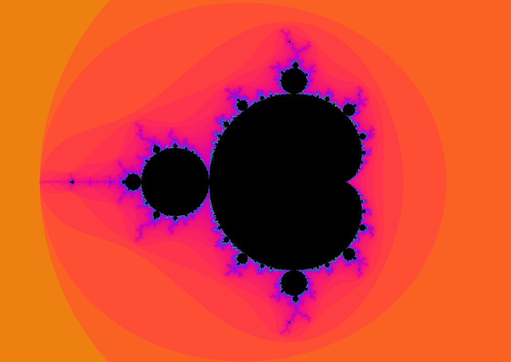

# fract-ol

 

## Project Introduction

`fract-ol` is a captivating journey into the infinite beauty of fractals, rendered directly on your screen using the MiniLibX graphics library in C. This project serves as an exploration of the complex plane, revealing the intricate and self-similar patterns that emerge from simple mathematical iterations. Dive into the mesmerizing worlds of the Mandelbrot and Julia sets, experiencing the profound elegance of chaos and order intertwined.

## Mathematical Foundation

At the heart of `fract-ol` lies the fascinating realm of complex numbers and the **escape-time algorithm**.

**Complex Numbers:** Fractals like the Mandelbrot and Julia sets are defined in the complex plane, where each point $c$ is a complex number of the form $a + bi$, with $a$ being the real part and $b$ the imaginary part.

**Escape-Time Algorithm:** To determine the color of each pixel on the screen, we iterate a simple function for a given complex number $c$ (representing the pixel's coordinate) and an initial complex number $z_0$:

$z_{n+1} = z_n^2 + c$

For the **Mandelbrot set**, $z_0 = 0$ and $c$ is the complex coordinate of the pixel.
For the **Julia set**, $c$ is a fixed complex parameter (chosen by the user), and $z_0$ is the complex coordinate of the pixel.

The algorithm checks how many iterations it takes for the magnitude of $z_n$ to "escape" (i.e., exceed a certain threshold, typically 2). Points that escape quickly are colored differently from those that remain bounded for many iterations. Points that never escape (or take a very large number of iterations) are considered part of the set and are typically colored black.

## Key Features

*   **Window Resizing & Event Handling:** The application gracefully handles window resizing, adapting the fractal rendering to new dimensions. Interactive keyboard hooks allow for precise movement (panning) across the complex plane.

## Technical Challenges

Developing `fract-ol` presented several interesting technical challenges, primarily centered around performance and precise graphical manipulation:

*   **Optimization of the Rendering Loop:** Given the iterative nature of fractal generation, optimizing the core rendering loop was crucial. This involved minimizing calculations, efficient use of integer arithmetic where possible, and careful management of iteration counts to balance detail and speed.
*   **Pixel-by-Pixel Manipulation:** MiniLibX requires direct pixel manipulation to draw the fractal. This involved calculating the color for each individual pixel based on the escape-time algorithm and then writing that color data to the image buffer. Ensuring this process was fast enough for interactive zooming and panning demanded a deep understanding of memory access patterns and MiniLibX's image handling.

## Installation & Usage

To compile and run `fract-ol`, follow these steps:

1.  **Clone the repository:**
    ```bash
    git clone https://github.com/your_username/fract-ol.git
    cd fract-ol
    ```

2.  **Compile the project:**
    ```bash
    make
    ```

3.  **Run the program:**

    *   **Mandelbrot Set:**
        ```bash
        ./fractol mandelbrot
        ```

    *   **Julia Set:**
        You can specify the real and imaginary parts of the complex constant `c` for the Julia set.
        ```bash
        ./fractol julia 0.285 0.01
        ```
        (Example values for `c`: `0.285 0.01`, `-0.8 0.156`, `-0.70176 -0.3842`)

    *   **Invalid Arguments:**
        ```bash
        ./fractol
        # or
        ./fractol invalid_fractal
        ```
        This will display usage instructions.

## Controls

*   **Mouse Wheel Up/Down:** Zoom In/Out
*   **`ESC` Key:** Exit the program

## Visuals

### Mandelbrot Set


